## Posting and Viewing Posts
### Homescreen
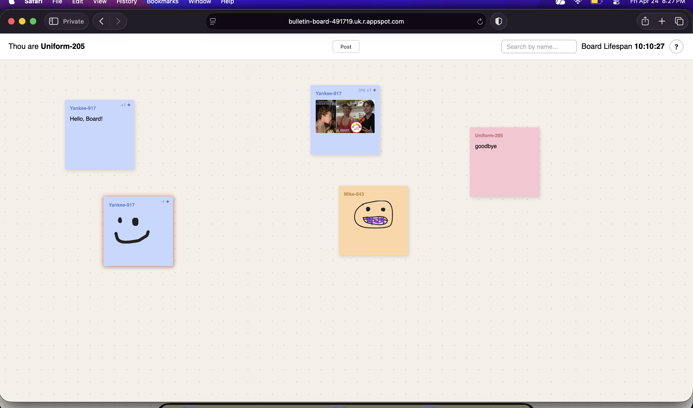
> Main screen of the Board. Toolbar is on the top, with the Board's contents below.

### Posting and creating a text post
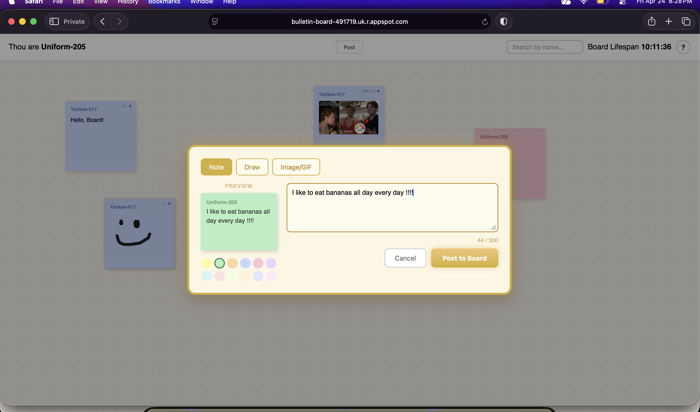
> Modal for creating a text post. You can select the sticky note color. Your post may appear truncated if it is too long.

### Placing a post example
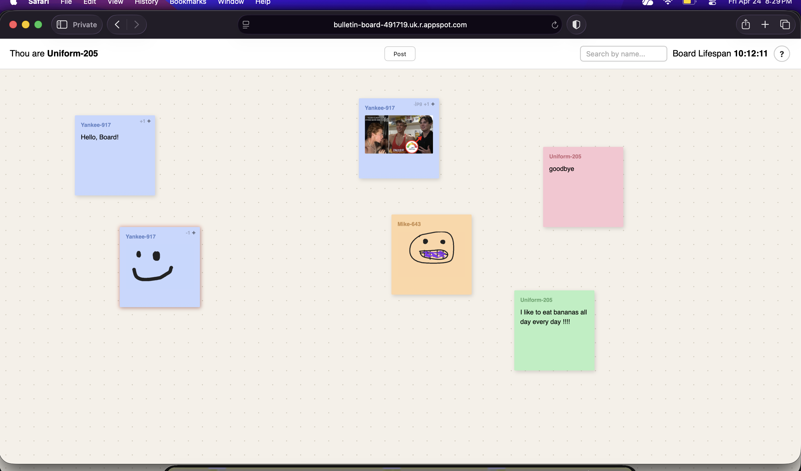
> After confirming to post, you have a ghost view of your post, and can click anywhere to post it.

### Drawing Post
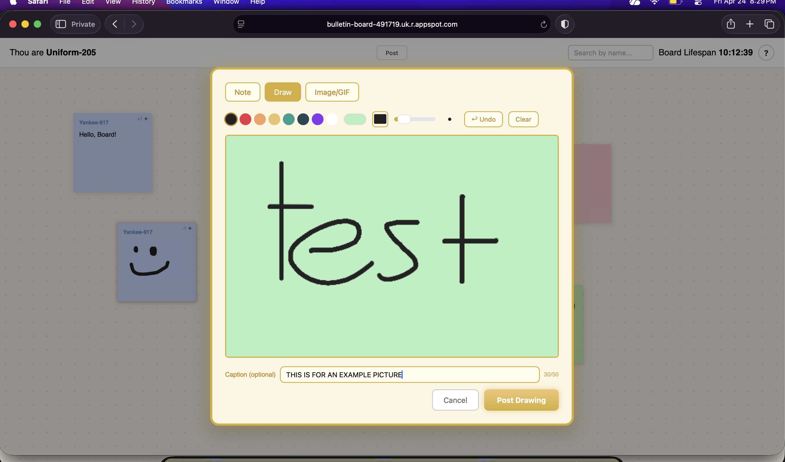
> In the post modal, you can click the 'draw' button to create a drawing. You can select the color of the brush and the background. **NOTE**: the Drawing will reset if you change the background. You can also change the width of the brush. Additionally, you can press the **undo** button to undo an action or **clear** to clear the whole thing. You can apply a caption to your drawing, which will be seen when a user views it in full.

### Posting a drawing
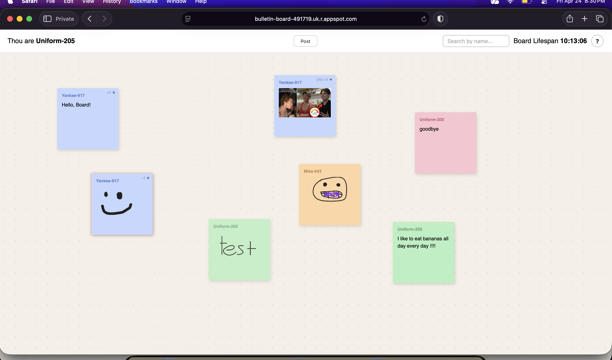
> Like text posts, when you confirm you want to post a drawing, a ghost view appears for the Post, where you can click anywhere to post it.

### Attachment Post
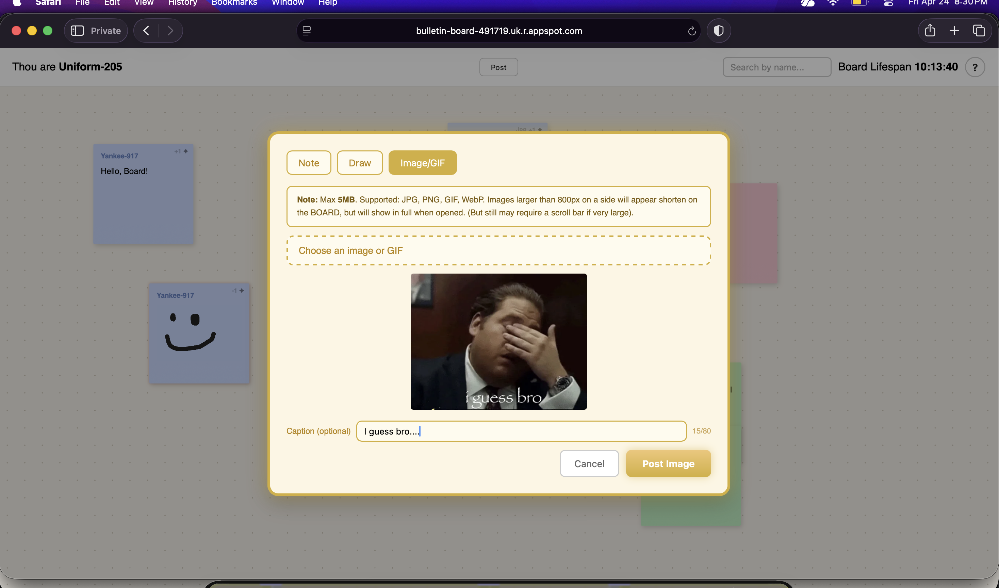
> You can also post attachments (gifs, images) as long as they are below 5MB and are a supported file extension. Additionally, the post may appear truncated if it is too long on a side.  Attachment posts also have the option to give them a caption.

### Posting an Attachment
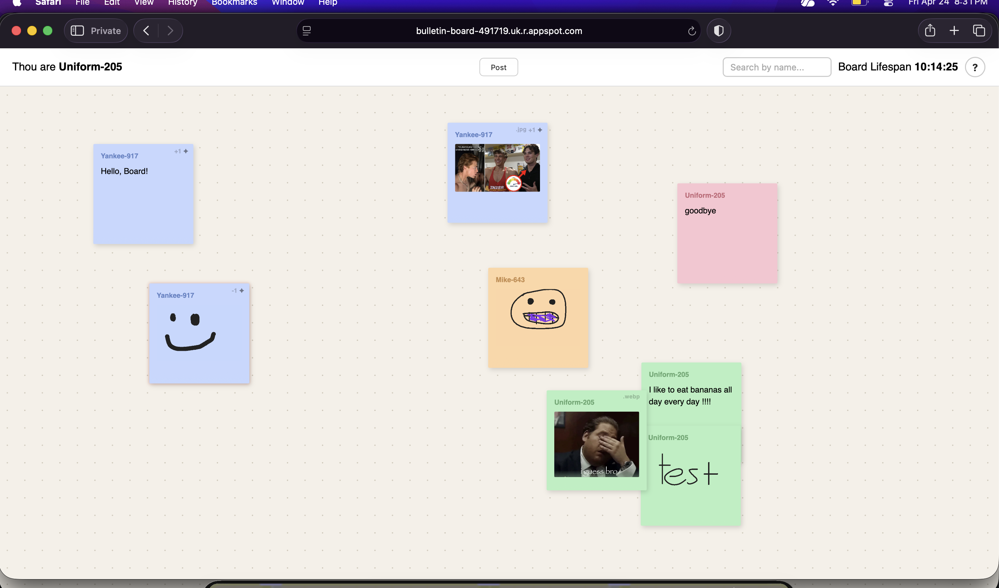
> Like drawings and text posts, you get a ghost view of the attachment that you can place anywhere. However, depending on the size of the attachment, it may take a few extra seconds to render and appear on the Board.

### Search bar
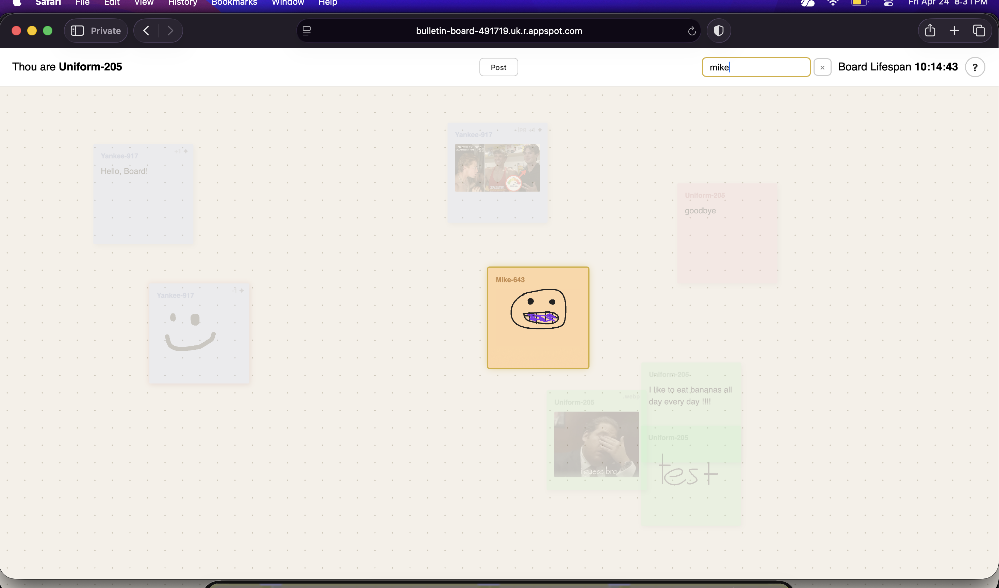
> To the left of the clock is a field to enter a name. It will highlight any names you enter, or numbers as well. It will dim out other names.

### Viewing and Scoring posts
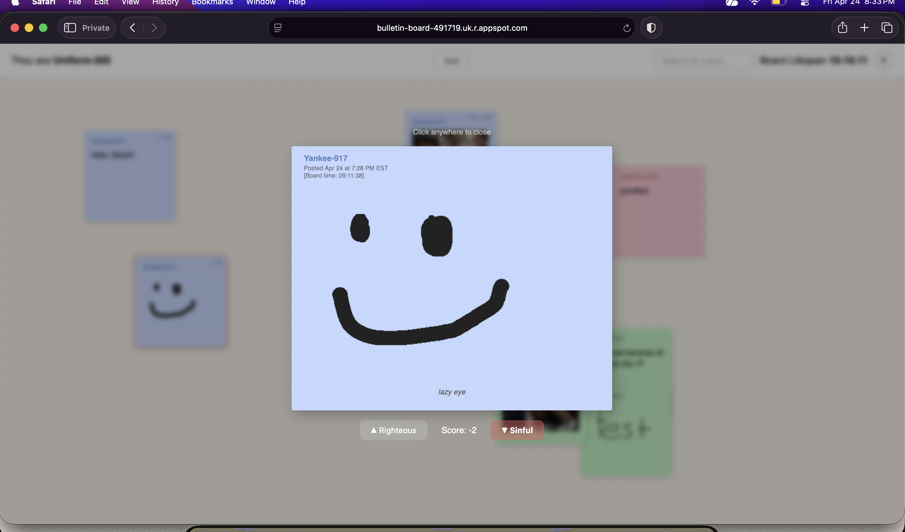
> You can view posts by clicking on them. Here, the post will be fullscreened and you will be able to see any captions it might have. You also see the poster's name on the top, the time posted (in EST) and the Board Time (when it was posted according to the Board's clock)  At the bottom are two buttons: -**righteous**, which will give the post a positive upvote. -**sinful**, which will give the post a negative downvote.

## Trials
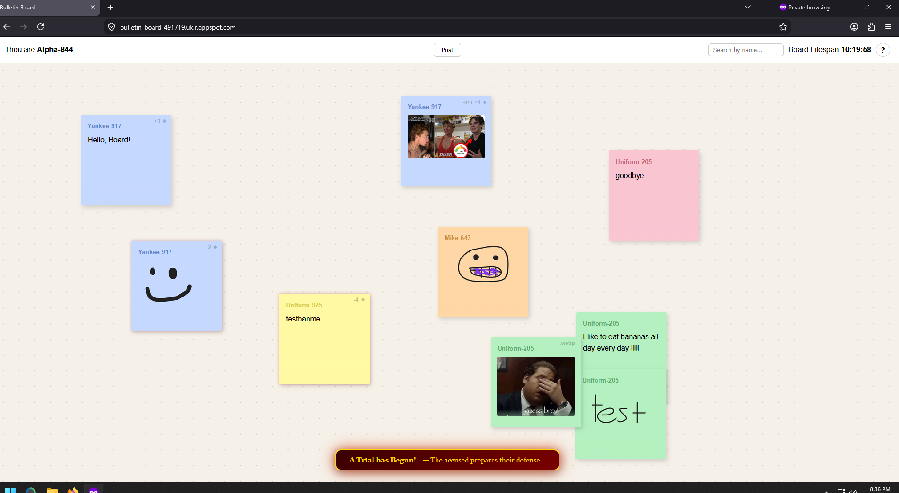
> When a post reaches a score of **-4**, the Board will deem it's author as an **Accused transgressor** and initiate a **Trial**. Everyone, except for the Accused, will get a toast at the bottom telling everyone a trial has started.  In this image, *Uniform-925* is the Accused.

### Accused's Defense
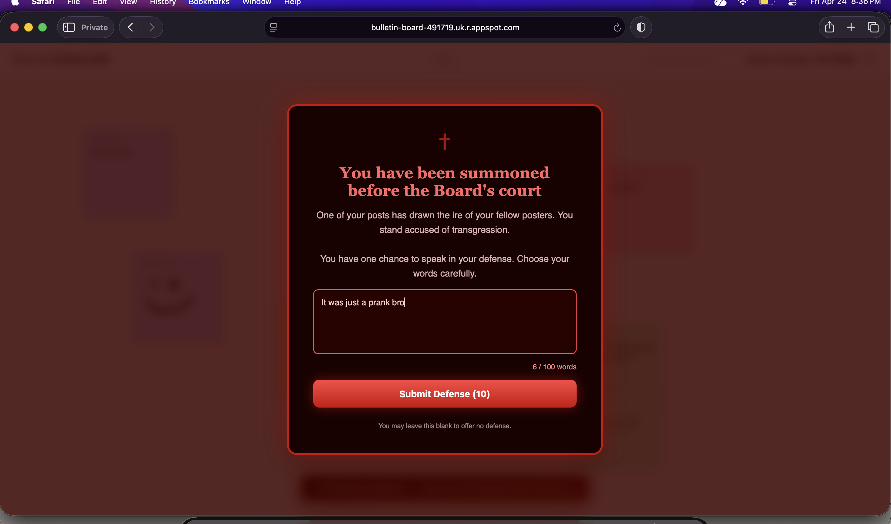
> Instead of just seeing the Trial Start toast, the Accused will be given a unique modal, where they are told they are about to be put on trial. The Accused can write a defense, and has thirty seconds to do so. If no defense it given, it is left blank.

### Trial start & Jury Duty
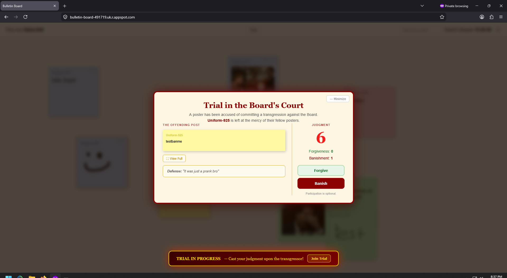
> After the Accused has given their defense, or thirty seconds have passed, the voting begins. Every active user will see a toast on the bottom telling them they can join the trial and decide the verdict of the Accused. There are three verdicts: -**Banish**: banish the Accused, preventing their return until the next reset -**Forgive**: forgive the Accused and let them stay -**Exile**: when there is a tie, the Board will banish the Accused for a limited time.
 

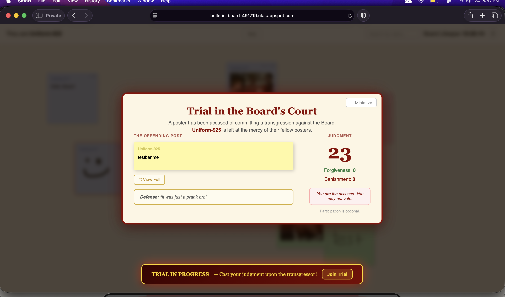
> This is the Accused (defendant's) screen. They cannot vote on their verdict
 

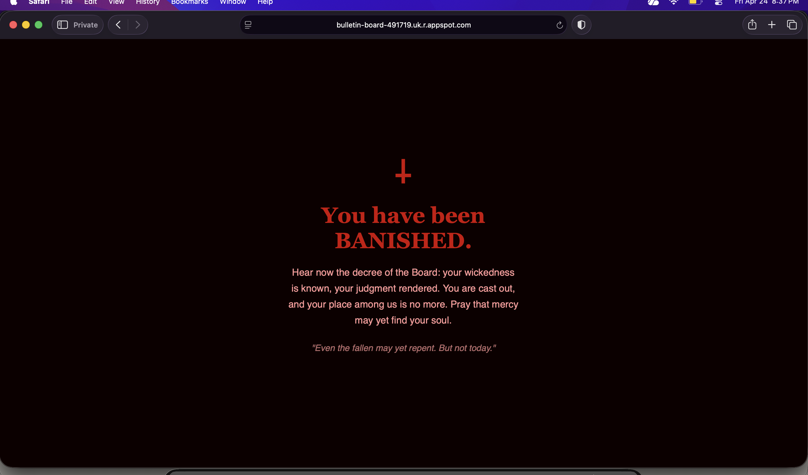
> This is what the Accused will see if they are banished.

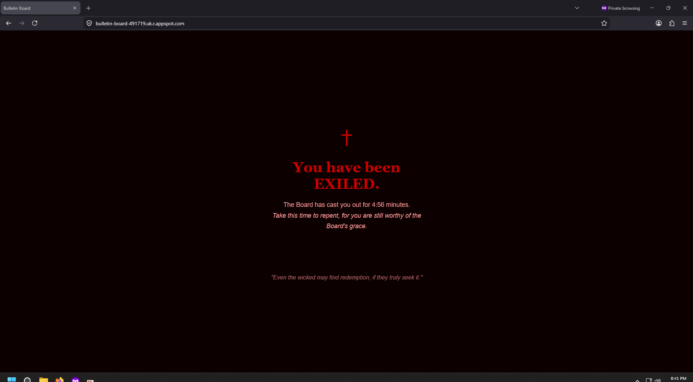
> This is what the Accused will see if they are exiled. They are given a set time when they will be let back.

### Denouncement
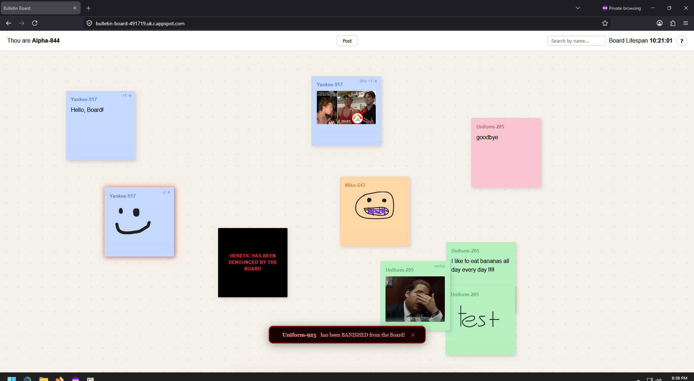
> Upon a verdict, every user will see a toast with the results.  When a poster is either **Banished** or **Exiled** all of their posts will become denounced; reduce to black squares, all of its contents erased, and lost in time.

## Floods
Floods are a premature reset of the Board due to the negligence of the posters. There are two main ways a flood event is triggered. Either through excessive **wickedness** or **moderation**.

### Flood due to Wickedness
A Flood due to **wickedness** occurs when **two** users have been **banished** by the Board. When a **3rd** user is about to be put on Trial, the Board will instead call upon a great flood to purge everything, as the people have proven their generation is too wicked for the Board's grace.

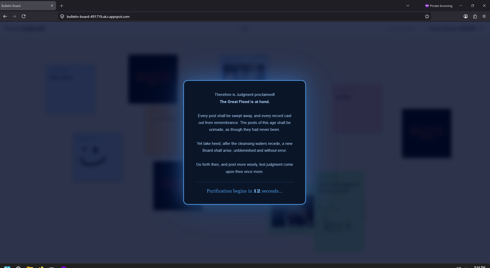
> Users will receive this popup when a Flood is triggered via wickedness. After 20 seconds, a flood animation will play.

### Flood due to Moderation
A Flood due to **moderation** occurs when a post by a user has been flagged by either the **Natural Language** API (text and captions) or by the **Vision** API (images and other attachments).

#### Flood warning modal from Moderation

> When a Flood is triggered from moderation, a different warning appears with different text. It names drop the author of the offending post.

#### Flood triggered by moderated text
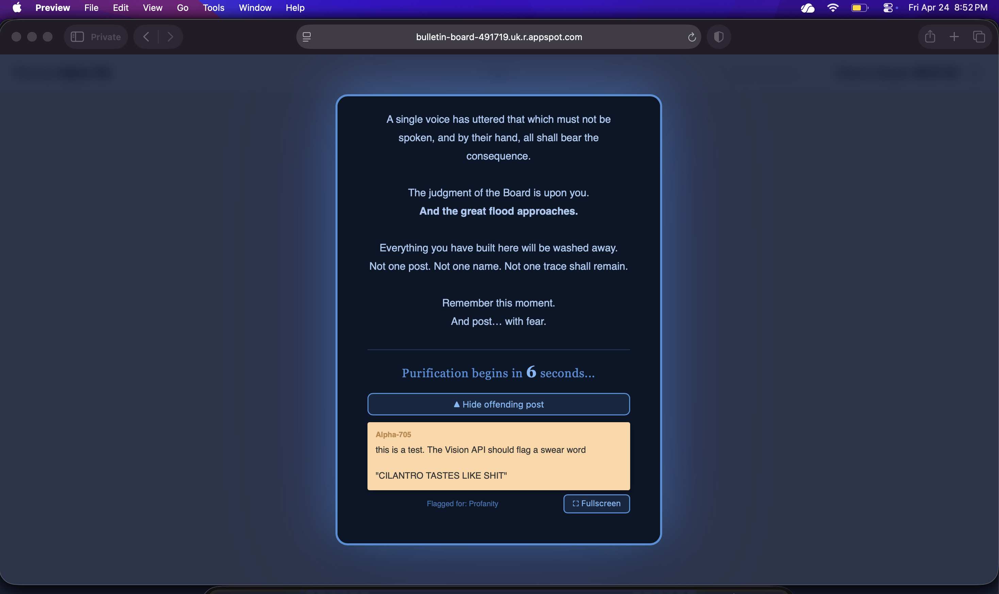
> When a post is flagged, it is shown in the warning screen. In this example, Natural Language API flagged a post for profanity, and triggered a flood due to it.

#### Flood triggered by moderated attachment
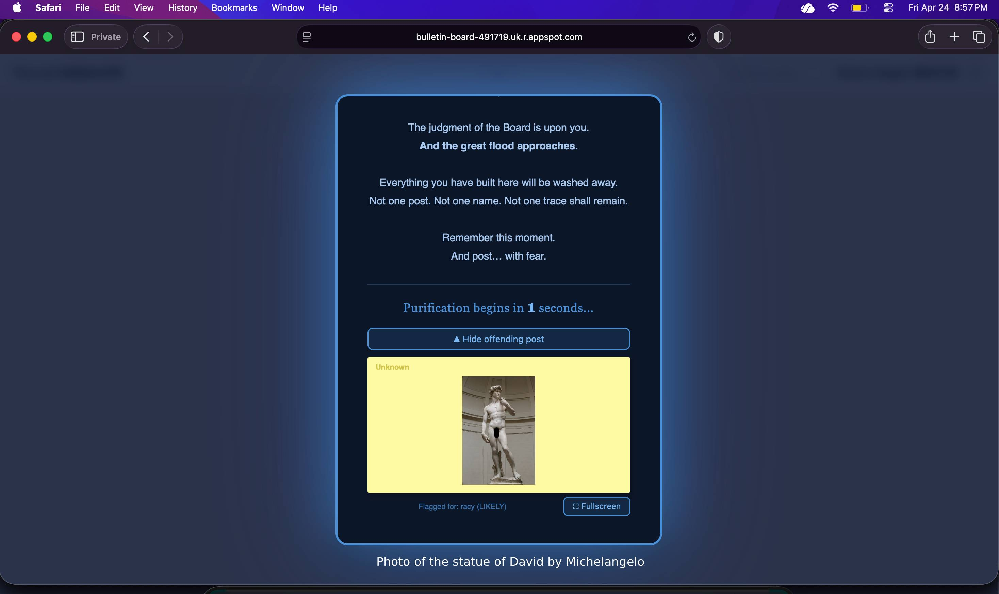
> When a post with an attachment is flagged, it is also shown in the flood moderation screen. In this one, Vision API flagged a image of the statue of a naked David as "racy", and triggered a flood.

### Flood start
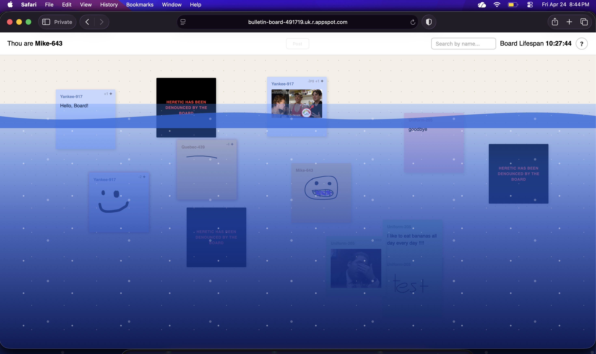
> After the twenty second warning, an animation will play, where water rises from the bottom and floods the board over the course of sixty seconds. When the water reaches around 75%, it disables all forms of interacting with the Board (posting, viewing, etc.)

### Submerged

> When the Flood water reaches the top, it will transition to a 'submerged' screen, where a new board is created. All contents of the last board is wiped.

## Resets
Resets either happen after a Flood is completed (the 'submerged' screen goes away) or every midnight. Both conditions cause the same outcome.
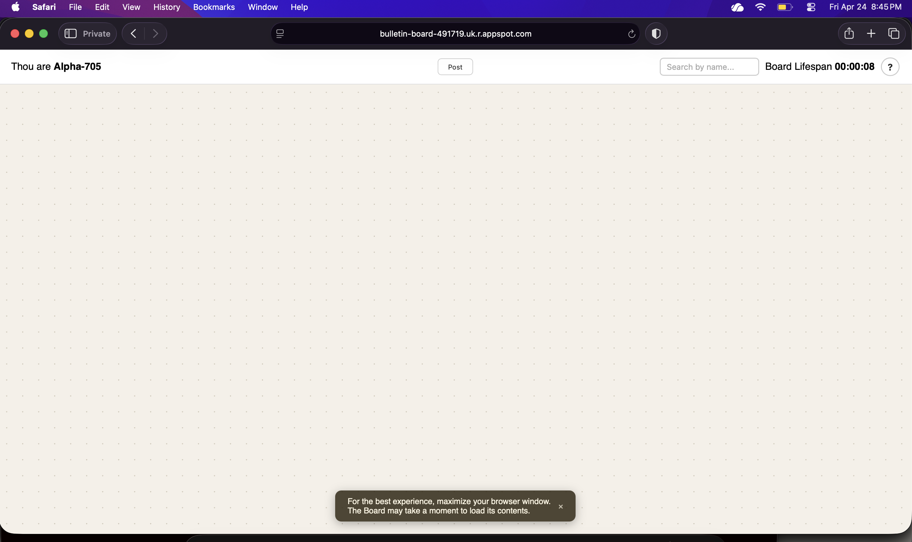
> When the Board reset from either the daily reset or a flood, all Users are prompted with the Commandment screen once more, and given another name, and everything starts a new.
